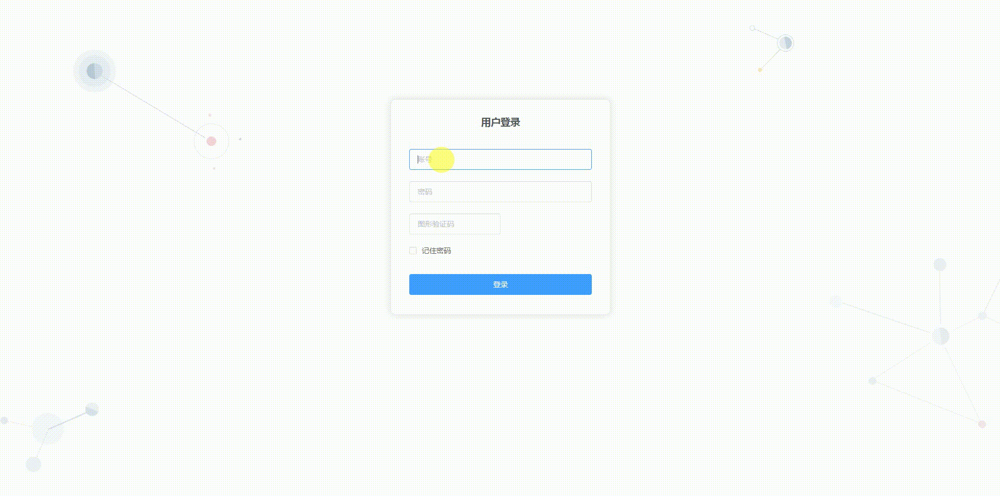

# vue搭建后台管理界面模版（PC端）
------------------------




#### 技术栈
vue2 + vuex + vue-router + webpack + ES6/7 + axios + elementUI + 阿里图标iconfont

#### 项目预览
[http://nmgwap.gitee.io/vueproject/#/login](http://nmgwap.gitee.io/vueproject/#/login)


#### 目录结构
------------------------

```bash
├── /build/          # 项目构建(webpack)相关配置
├── /config/         # 项目开发环境配置
├── /src/            # 源码目录
│ ├── /api/          # 请求
│ ├── /assets/       # 组件静态资源(图片)
│ ├── /components/   # 公共组件
| ├── /api/          # 请求接口
│ ├── /router/       # 路由配置
│ ├── /vuex/         # vuex状态管理
│ ├── /views/        # 路由组件(页面维度)
│ ├── /config/       # 接口配置文件（请求地址）
│ ├── App.vue        # 组件入口
│ └── main.js        # 程序入口
├── /static/         # 非组件静态资源
├── .babelrc         # ES6语法编译配置
├── .editorconfig    # 定义代码格式
├── .eslintignore    # ES6规范忽略文件
├── .eslintrc.js     # ES6语法规范配置
├── .gitignore       # git忽略文件
├── index.html       # 页面入口
├── package.json     # 项目依赖
└── README.md        # 项目文档
```

#### 强调

项目请求已经改为假数据，例如：
``` bash
// 模拟数据开始
      let res = {
        code: 0,
        msg: null,
        count: 12,
        data: [
          {
            addUser: '1',
            editUser: '1',
            addTime: null,
            editTime: 1527411068000,
            userId: 1,
            systemNo: 'pmd',
            userName: 'root',
            userPassword: 'e10adc3949ba59abbe56e057f20f883e',
            userRealName: '超级管理员',
            userSex: '女',
            userMobile: '138123456789',
            userEmail: '111@qq.com',
            isLock: 'N',
            deptId: 1,
            deptName: 'xxxx',
            roleId: 1
          }
        ]
      }
      this.loading = false
      this.userData = res.data
      // 分页赋值
      this.pageparm.currentPage = this.formInline.page
      this.pageparm.pageSize = this.formInline.limit
      this.pageparm.total = res.count
      // 模拟数据结束

      /***
       * 调用接口，注释上面模拟数据 取消下面注释
       */
      // 获取用户列表
      // userList(parameter).then(res => {
      //   this.loading = false
      //   if (res.success == false) {
      //     this.$message({
      //       type: 'info',
      //       message: res.msg
      //     })
      //   } else {
      //     this.userData = res.data
      //     // 分页赋值
      //     this.pageparm.currentPage = this.formInline.page
      //     this.pageparm.pageSize = this.formInline.limit
      //     this.pageparm.total = res.count
      //   }
      // })
```
把模拟数据开始到结束注释掉，下面解除注释即可，
接口地址需要修改config/index.js文件 dev
``` bash
proxyTable: {
    '/api': {
        target: 'http://xxx.xxx.xxx.xxx:xxx', // 你请求的第三方接口
        changeOrigin: true, // 在本地会创建一个虚拟服务端，然后发送请求的数据，并同时接收请求的数据，这样服务端和服务端进行数据的交互就不会有跨域问题
        pathRewrite: { // 路径重写，
            '^/api': '/api' // 替换target中的请求地址，也就是说以后你在请求http://api.jisuapi.com/XXXXX这个地址的时候直接写成/api即可。
        }
    }
},

```
#### 完成功能
- [x] 登录 -- 完成
- [x] 路由拦截 -- 完成
- [x] 文章列表（增加、编辑、搜索、删除） -- 完成
- [x] 角色管理（增加、编辑、搜索、删除、权限管理） -- 完成
- [x] 交易订单（增加、编辑、搜索、删除） -- 完成
- [x] 用户管理（增加、编辑、搜索、删除、数据权限、刷新缓存） -- 完成
- [x] 支付配置（增加、编辑、搜索、删除） -- 完成
- [x] 系统环境变量（增加、编辑、搜索、删除） -- 完成
- [x] 权限管理（增加、编辑、搜索、删除、配置权限） -- 完成
- [x] 菜单管理（增加、编辑、搜索、删除） -- 完成


#### 运行项目
------------------------

``` bash
# install dependencies
npm install

# serve with hot reload at localhost:8080
npm run dev

# build for production with minification
npm run build

# build for production and view the bundle analyzer report
npm run build --report

# run unit tests
npm run unit

# run e2e tests
npm run e2e

# run all tests
npm test


```

#### 项目源码地址：
------------------------

github地址：https://github.com/yitiaopingguo/yitiaopingguo-admin.git


